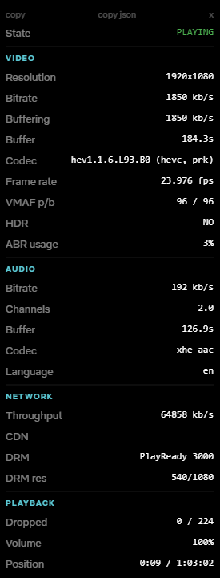

# Netflix Debug Overlay

Netflix's built-in debug panel (`Ctrl+Alt+Shift+D`) is cluttered and difficult to read.

This overlay presents the same information in a cleaner, more readable format so you can quickly verify:

- If you're actually getting what you're supposed to get
- If HDR is active
- What bitrate Netflix is delivering

<strong>What it shows</strong>

### VIDEO
- Resolution
- Bitrate (playing & buffering)
- Buffer size
- Codec
- Frame rate
- VMAF score (playing / buffering)
- HDR support with type if available
- ABR usage

### AUDIO
- Bitrate
- Channels
- Buffer size
- Codec
- Language
 
### NETWORK
- Throughput
- CDN hostname
- DRM system (Widevine, PlayReady, FairPlay)
- DRM max resolution
 
### PLAYBACK
- Dropped frames / total frames
- Volume
- Position / duration

## Disclaimer

This script is `read-only`. It only reads data that Netflix already exposes through their own built-in debug panel. It does not modify Netflix, intercept requests, or change anything about your playback.

## Installation

1. Install [Tampermonkey](https://www.tampermonkey.net/) or [Violentmonkey](https://violentmonkey.github.io/) for your browser
2. [Install the script](https://raw.githubusercontent.com/nicopasla/Netflix-Debug-Overlay/main/netflix-debug-overlay.user.js) Your userscript manager will prompt you to install it.

## Usage

1. Go to any Netflix watch page
2. Click the `Show Debug` button

## Notes

- The overlay only appears on `/watch` pages
- The overlay is not visible when fullscreen
- The overlay updates every second
- Uses Netflix Sans font when available

## License

MIT